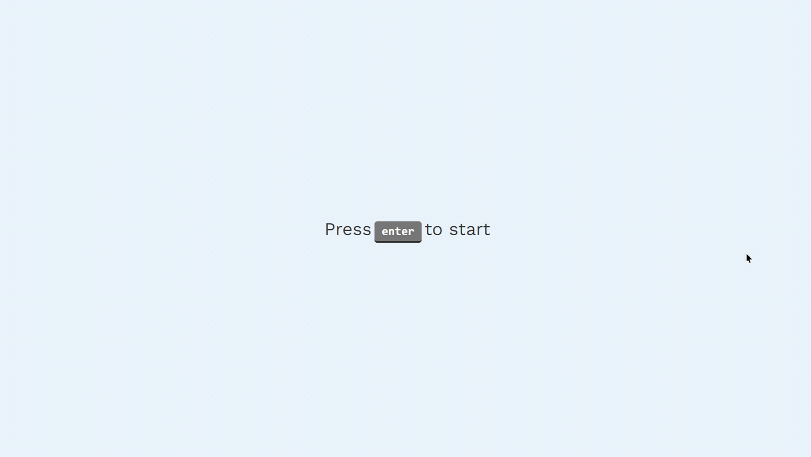

# weather-app with reactjs.
> a simple web app to see the weather.

## Technology stack

* **Front-end:** [React.Js](https://reactjs.org/)
* **Typing:** [TypeScript](https://www.typescriptlang.org/)
* **Deployment:** [Vercel](https://vercel.com/)

## Test Online
[Open website](https://weather-app-iamdevmarcos.vercel.app/)

## Running locally

### Installation
`npm install`

### To run the project
`npm run dev`

© Marcos Andre
